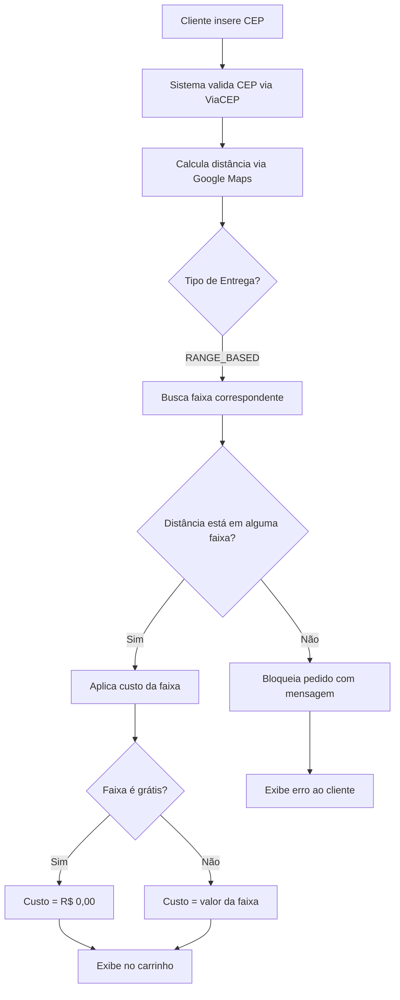

# 📏 Sistema de Frete Variável por Faixa de Distância

## 📋 Visão Geral

O sistema agora suporta **frete variável por faixa de distância**, permitindo configurar diferentes preços para diferentes intervalos de distância. Isso oferece máxima flexibilidade para definir sua estratégia de preços de entrega.

## ✨ Funcionalidades

### Configuração de Faixas

- ✅ **Múltiplas Faixas**: Adicione quantas faixas desejar
- ✅ **Intervalos Personalizados**: Defina distância mínima e máxima
- ✅ **Preços Flexíveis**: Configure o custo para cada faixa
- ✅ **Frete Grátis**: Marque faixas como gratuitas
- ✅ **Preview em Tempo Real**: Veja como ficará cada faixa
- ✅ **Validação Automática**: Sistema verifica se a distância do pedido está em alguma faixa

## 🎯 Exemplo de Uso

### Cenário Real

Você quer cobrar frete de forma escalonada:

```
1km a 3km   → Frete Grátis
3km a 5km   → R$ 10,00
5km a 7km   → R$ 15,00
7km a 10km  → R$ 20,00
```

### Como Configurar

1. **Acesse**: Admin → Entregas
2. **Tipo de Entrega**: Selecione "Custo Variável por Faixa de Distância"
3. **Adicionar Faixas**: Clique em "Adicionar Faixa"
4. **Configure cada faixa**:
   - Faixa 1: 1-3 km, marque "Grátis"
   - Faixa 2: 3-5 km, R$ 10,00
   - Faixa 3: 5-7 km, R$ 15,00
   - Faixa 4: 7-10 km, R$ 20,00
5. **Salvar**: Clique em "Salvar Configurações"

## 🏗️ Arquitetura Técnica

### 1. Banco de Dados

#### Nova Tabela: `distance_ranges`

```sql
CREATE TABLE "distance_ranges" (
  "id" TEXT PRIMARY KEY,
  "deliverySettingsId" TEXT NOT NULL,
  "minDistance" DOUBLE PRECISION NOT NULL DEFAULT 0,
  "maxDistance" DOUBLE PRECISION NOT NULL,
  "cost" DOUBLE PRECISION NOT NULL,
  "isFree" BOOLEAN NOT NULL DEFAULT false,
  "createdAt" TIMESTAMP(3) NOT NULL DEFAULT CURRENT_TIMESTAMP,
  "updatedAt" TIMESTAMP(3) NOT NULL,
  
  FOREIGN KEY ("deliverySettingsId") 
    REFERENCES "delivery_settings"("id") 
    ON DELETE CASCADE
);

-- Índice para otimizar buscas
CREATE INDEX "distance_ranges_deliverySettingsId_idx" 
ON "distance_ranges"("deliverySettingsId");
```

#### Relação no Schema Prisma

```prisma
model DeliverySettings {
  // ... campos existentes
  distanceRanges DistanceRange[]
}

model DistanceRange {
  id                 String           @id @default(cuid())
  deliverySettingsId String
  minDistance        Float            @default(0)
  maxDistance        Float
  cost               Float
  isFree             Boolean          @default(false)
  createdAt          DateTime         @default(now())
  updatedAt          DateTime
  deliverySettings   DeliverySettings @relation(fields: [deliverySettingsId], references: [id], onDelete: Cascade)

  @@map("distance_ranges")
}
```

#### Novo Enum no DeliveryType

```prisma
enum DeliveryType {
  FIXED
  VARIABLE
  FIXED_PLUS_KM
  FREE_ABOVE_VALUE
  RANGE_BASED  // ← NOVO
}
```

### 2. Types TypeScript

```typescript
// src/types/delivery.ts

export interface DistanceRange {
  id?: string;
  minDistance: number;
  maxDistance: number;
  cost: number;
  isFree: boolean;
}

export interface DeliverySettings {
  // ... campos existentes
  distanceRanges?: DistanceRange[];
}

export enum DeliveryType {
  // ... existentes
  RANGE_BASED = 'RANGE_BASED',
}
```

### 3. API Routes

#### GET `/api/delivery-settings`

Retorna configurações incluindo faixas:

```typescript
const settings = await prisma.deliverySettings.findFirst({
  include: {
    distanceRanges: {
      orderBy: { minDistance: 'asc' }
    }
  }
});
```

**Response:**
```json
{
  "id": "...",
  "deliveryType": "RANGE_BASED",
  "distanceRanges": [
    {
      "id": "range1",
      "minDistance": 1,
      "maxDistance": 3,
      "cost": 0,
      "isFree": true
    },
    {
      "id": "range2",
      "minDistance": 3,
      "maxDistance": 5,
      "cost": 10.00,
      "isFree": false
    }
  ]
}
```

#### POST/PUT `/api/delivery-settings`

Cria/atualiza com faixas:

```typescript
// POST - Criar com faixas
await prisma.deliverySettings.create({
  data: {
    // ... outros campos
    distanceRanges: {
      create: body.distanceRanges.map(range => ({
        minDistance: range.minDistance,
        maxDistance: range.maxDistance,
        cost: range.cost,
        isFree: range.isFree
      }))
    }
  },
  include: {
    distanceRanges: { orderBy: { minDistance: 'asc' } }
  }
});

// PUT - Atualizar (deleta antigas, cria novas)
await prisma.distanceRange.deleteMany({
  where: { deliverySettingsId: currentSettings.id }
});

await prisma.deliverySettings.update({
  data: {
    // ... outros campos
    distanceRanges: {
      create: body.distanceRanges.map(/* ... */)
    }
  }
});
```

### 4. Componente de Interface

#### `DistanceRangeManager`

Componente React para gerenciar faixas:

```tsx
<DistanceRangeManager
  ranges={formData.distanceRanges}
  onChange={(ranges) => 
    setFormData(prev => ({ ...prev, distanceRanges: ranges }))
  }
/>
```

**Funcionalidades:**
- ✅ Adicionar novas faixas
- ✅ Remover faixas existentes
- ✅ Editar distâncias (min/max)
- ✅ Definir custo ou marcar como grátis
- ✅ Preview visual de cada faixa
- ✅ Validação automática

### 5. Cálculo de Frete

#### Hook: `useDeliveryCalculator`

```typescript
case 'RANGE_BASED':
  if (settings.distanceRanges?.length > 0) {
    // Buscar faixa que contém a distância
    const matchingRange = settings.distanceRanges.find(
      range => distance >= range.minDistance && 
               distance <= range.maxDistance
    );

    if (matchingRange) {
      cost = matchingRange.isFree ? 0 : matchingRange.cost;
      isFree = matchingRange.isFree;
    } else {
      // Distância fora de todas as faixas
      throw new Error(
        `Não entregamos nesta distância (${distance.toFixed(1)}km)`
      );
    }
  }
  break;
```

**Fluxo:**
1. Cliente insere CEP no carrinho
2. Sistema calcula distância via Google Maps API
3. Busca faixa correspondente à distância
4. Aplica custo da faixa (ou grátis)
5. Se não houver faixa, bloqueia pedido

## 🎨 Interface de Usuário

### Modo Visualização (Admin)

```tsx
{settings.deliveryType === DeliveryType.RANGE_BASED && 
 settings.distanceRanges?.length > 0 && (
  <div>
    <p className="mb-3 text-sm font-medium">Faixas de Distância</p>
    <div className="space-y-2">
      {settings.distanceRanges.map(range => (
        <div className="flex justify-between">
          <span>{range.minDistance}km - {range.maxDistance}km</span>
          <span>{range.isFree ? 'Frete Grátis' : `R$ ${range.cost}`}</span>
        </div>
      ))}
    </div>
  </div>
)}
```

### Modo Edição (Admin)

```tsx
{formData.deliveryType === DeliveryType.RANGE_BASED && (
  <DistanceRangeManager
    ranges={formData.distanceRanges}
    onChange={(ranges) => 
      setFormData(prev => ({ ...prev, distanceRanges: ranges }))
    }
  />
)}
```

**Cada Faixa Mostra:**
- Campo "De (km)" - distância mínima
- Campo "Até (km)" - distância máxima
- Campo "Custo (R$)" - valor do frete
- Checkbox "Grátis" - marca faixa como gratuita
- Botão "Remover" - exclui a faixa
- Preview - mostra como ficará

### Carrinho (Cliente)

No carrinho, exibe automaticamente:

```
Endereço de entrega:
Rua Exemplo, 123
Bairro Exemplo
Cidade/SP

Distância: 4.5km
Taxa de entrega: R$ 10,00  ✅ (faixa 3-5km)
```

## 📊 Exemplos Práticos

### Exemplo 1: Restaurante Local

```
0-2 km   → Frete Grátis (incentiva pedidos próximos)
2-4 km   → R$ 5,00 (área urbana)
4-6 km   → R$ 10,00 (bairros afastados)
6-8 km   → R$ 15,00 (limite da cidade)
```

### Exemplo 2: E-commerce Regional

```
0-10 km   → Frete Grátis (cidade sede)
10-30 km  → R$ 15,00 (região metropolitana)
30-50 km  → R$ 30,00 (cidades vizinhas)
50-100 km → R$ 50,00 (interior)
```

### Exemplo 3: Delivery Premium

```
0-5 km   → R$ 8,00 (taxa básica)
5-10 km  → R$ 12,00
10-15 km → R$ 18,00
15-20 km → R$ 25,00
```

## 🔍 Validações Automáticas

### No Frontend

1. **Faixas Sequenciais**: Sistema sugere próxima distância mínima
2. **Min < Max**: maxDistance deve ser maior que minDistance
3. **Custo ≥ 0**: Não permite valores negativos
4. **Checkbox Grátis**: Ao marcar, zera o custo automaticamente

### No Backend

1. **Distância Válida**: Verifica se está em alguma faixa
2. **Configuração Existe**: Valida se há faixas configuradas
3. **Delete Cascade**: Ao deletar configuração, remove faixas

## 🚀 Fluxo Completo de Um Pedido



## 📝 Migração de Banco

### Script de Migração

```javascript
// scripts/add-distance-ranges.js
const { PrismaClient } = require('@prisma/client');
const prisma = new PrismaClient();

async function main() {
  await prisma.$executeRawUnsafe(`
    CREATE TABLE IF NOT EXISTS "distance_ranges" (
      "id" TEXT NOT NULL PRIMARY KEY,
      "deliverySettingsId" TEXT NOT NULL,
      "minDistance" DOUBLE PRECISION NOT NULL DEFAULT 0,
      "maxDistance" DOUBLE PRECISION NOT NULL,
      "cost" DOUBLE PRECISION NOT NULL,
      "isFree" BOOLEAN NOT NULL DEFAULT false,
      "createdAt" TIMESTAMP(3) NOT NULL DEFAULT CURRENT_TIMESTAMP,
      "updatedAt" TIMESTAMP(3) NOT NULL,
      CONSTRAINT "distance_ranges_deliverySettingsId_fkey" 
        FOREIGN KEY ("deliverySettingsId") 
        REFERENCES "delivery_settings"("id") 
        ON DELETE CASCADE
    );
  `);

  await prisma.$executeRawUnsafe(`
    CREATE INDEX IF NOT EXISTS "distance_ranges_deliverySettingsId_idx" 
    ON "distance_ranges"("deliverySettingsId");
  `);

  console.log('✅ Migração concluída!');
}

main();
```

**Executar:**
```bash
node scripts/add-distance-ranges.js
npx prisma generate
```

## 🎯 Boas Práticas

### ✅ DO

- **Cobrir toda área de entrega**: Configure faixas que cubram toda a distância desejada
- **Faixas sequenciais**: maxDistance da faixa anterior = minDistance da próxima
- **Teste com CEPs reais**: Valide que o cálculo funciona corretamente
- **Preços progressivos**: Geralmente o custo aumenta com a distância
- **Frete grátis estratégico**: Use em faixas próximas para incentivar pedidos

### ❌ DON'T

- **Faixas sobrepostas**: Evite ranges que se sobrepõem (causa ambiguidade)
- **Gaps entre faixas**: Não deixe "buracos" sem cobertura
- **Preços aleatórios**: Mantenha lógica progressiva de preços
- **Muitas faixas**: Excesso de faixas pode confundir
- **Faixas muito pequenas**: Intervalos de 0.1km são imprecisos

## 🧪 Testes Recomendados

### Teste 1: Faixa Gratuita
```bash
CEP: [CEP próximo, 1-3km]
Resultado esperado: "Frete Grátis"
```

### Teste 2: Faixa com Custo
```bash
CEP: [CEP médio, 4-5km]
Resultado esperado: "R$ 10,00"
```

### Teste 3: Distância Fora das Faixas
```bash
CEP: [CEP distante, >10km]
Resultado esperado: "Não entregamos nesta distância"
```

### Teste 4: Múltiplas Faixas
```bash
CEP 1: 2km → Grátis
CEP 2: 4.5km → R$ 10,00
CEP 3: 6.5km → R$ 15,00
CEP 4: 9km → R$ 20,00
```

## 📚 Comparação com Outros Tipos

| Tipo de Frete | Quando Usar | Exemplo |
|---------------|-------------|---------|
| **Custo Fixo** | Área pequena, preço único | R$ 5,00 para todos |
| **Variável (por KM)** | Cobrança proporcional | R$ 2,00/km |
| **Fixo + por KM** | Taxa básica + distância | R$ 5,00 + R$ 1,00/km |
| **Grátis Acima de Valor** | Incentivo compras maiores | Grátis acima de R$ 50 |
| **Por Faixa (NOVO)** | **Máxima flexibilidade** | **Preços customizados** |

## 🔧 Troubleshooting

### Problema: "Faixas de distância não configuradas"
**Solução**: Adicione pelo menos uma faixa no admin

### Problema: "Não entregamos nesta distância"
**Solução**: Verifique se há faixa que cobre a distância calculada

### Problema: Frete calculado errado
**Solução**: Confirme que não há sobreposição de faixas

### Problema: Faixas não aparecem no carrinho
**Solução**: Verifique se deliveryType está como RANGE_BASED

## 📖 Documentação Relacionada

- [Google Maps Integration](./GOOGLE_MAPS_INTEGRATION.md)
- [Delivery Setup](./DELIVERY_SETUP.md)
- [Cart Delivery Implementation](./CART_DELIVERY_IMPLEMENTATION.md)
- [Security Guide](./SECURITY.md)

## 🎉 Resumo

O sistema de **frete variável por faixa de distância** oferece:

✅ **Flexibilidade Total**: Configure quantas faixas quiser  
✅ **Frete Grátis**: Marque faixas como gratuitas  
✅ **Preços Personalizados**: Defina o custo para cada intervalo  
✅ **Validação Automática**: Sistema bloqueia pedidos fora das faixas  
✅ **Interface Intuitiva**: Componente visual para gerenciar faixas  
✅ **Preview em Tempo Real**: Veja como ficará antes de salvar  

---

**Última atualização:** 14 de outubro de 2025  
**Versão:** 1.0.0
